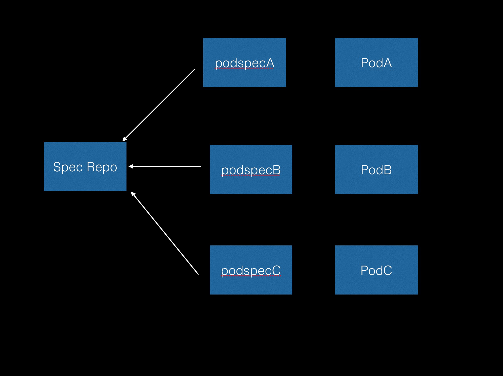
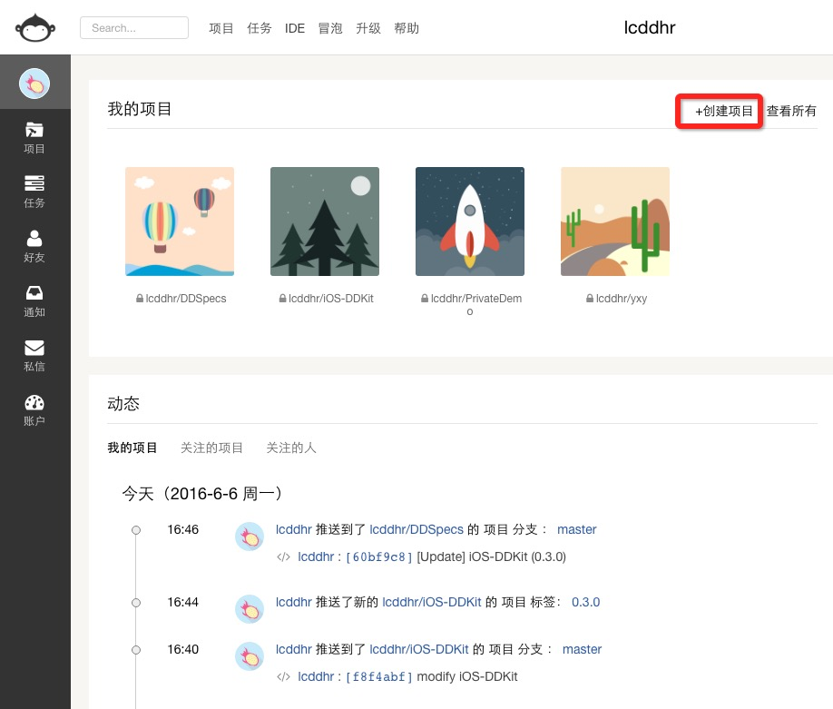
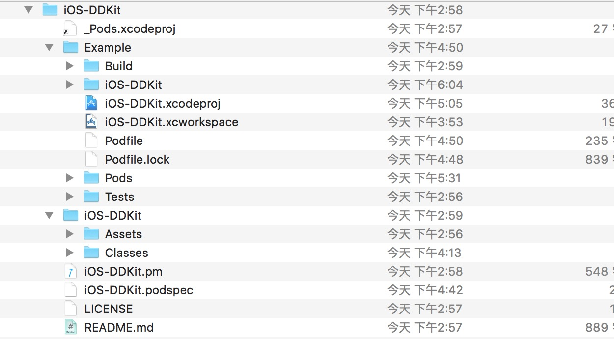

## 简介
`Cocoapods`是iOS上非常好用的一个依赖管理工具。能够方便的管理和更新第三方库, 或者管理自己的私有库。

这里利用[Coding](https://coding.net) ( git )和`Cocoapods`来实现私有库

## 创建过程
+	创建`Spec Repo`
+	创建私有Pod项目的工程，建议通过命令来创建模板，下面会提到
+	创建podspec文件
+	测试podspec文件的可用性
+	向`Spec Repo`提交podspec
+	在项目的`Podfile`里面引入刚制作的`Pod`测试使用


下面就针对这过程进行详细的解释

#### Spec Repo
这是一个git仓库,里面存放着组件的podspec文件，`podspec`文件的作用是组件的一些配置，例如名称、文件存放的地址、作者、依赖的库等等. 就是一个容器，当我们使用pod命令引入的时候，会从这个仓库里面找到对应的私有库。

github上面私有仓库要收费，所以这里我们使用国内的[Coding](https://coding.net)平台。

在Coding平台上创建一个Spec Repo项目 

这里创建好的地址是：[https://git.coding.net/lcddhr/DDSpecs.git](https://git.coding.net/lcddhr/DDSpecs.git)

在本地创建Spec添加到cocoapod目录下面

```
	pod repo add DDSpecs https://git.coding.net/lcddhr/DDSpecs.git

```

+	DDSpecs: 是Spec的名字

进入`~/.cocoapods/repos`目录下面，可以找到`DDSpecs`的话，说明Specs创建成功

#### 创建私有Pod项目的工程

```
	pod lib create iOS-DDKit
```

+	iOS-DDKit:这里是项目工程的名字

创建完成后目录如下：这里并没有引入测试框架。生成了一个`Example`是例子工程。`iOS-DDKit`是存放私有库的地方，`Assets`是存放资源文件，`Classes`使用来存放我们私有库的地方。



将工程文件推送到Coding平台单独创建的git私有库上面，在当前目录下面执行命令,把文件推送到远端并且标记tag值

```
$ git add .
$ git commit -s -m "Create private repository"
$ git remote add origin git@coding.net:lcddhr/iOS-DDKit.git  
$ git push origin master     
$ git tag -m "release 0.1.0" 0.1.0
$ git push --tags   
``` 
#### 设置podspec

打开目录下面的podspec文件

```
	
Pod::Spec.new do |s|
  s.name             = 'iOS-DDKit'
  s.version          = '0.1.0'
  s.summary          = 'DD Private Kit Named iOS-DDKit.'

  s.description      = <<-DESC
TODO: Add long description of the pod here.
                       DESC
  s.homepage         = 'https://coding.net/u/lcddhr/p/iOS-DDKit'
  s.license          = { :type => 'MIT', :file => 'LICENSE' }
  s.author           = { 'lcd' => 'lcddhr@qq.com' }
  s.source           = { :git => 'https://git.coding.net/lcddhr/iOS-DDKit.git', :tag => '0.1.0' }
 
  # 版本要求
  s.ios.deployment_target = '7.0'
  
  #  如果不用分目录的话, 请把这个注释打开, 这里指向的是Classes目录下面的所有文件
  # s.source_files = 'iOS-DDKit/Classes/**/*'
  
  # 如果有资源文件的话,比如bundle或者xib等,需要打开这个注释
  # s.resource_bundles = {
  #   'iOS-DDKit' => ['iOS-DDKit/Assets/*.png']
  # }


   s.public_header_files = 'iOS-DDKit/Classes/**/*.h'
   s.frameworks = 'UIKit', 'Foundation'
  
  # 设置需要引入的第三方库
  # s.dependency 'AFNetworking', '~> 2.3'

   #分目录
   s.subspec 'UIView' do |ss|
   ss.source_files = 'iOS-DDKit/Classes/**/*'
   end

end
```
#### 验证podspec的可用性

```
	pod lib lint
```

出现下面这个提示，则说明podspec是可用的

```
-> iOS-DDKit (0.1.0)

iOS-DDKit passed validation.
```

#### 提交podspec到Spec Repo

```
	pod repo push DDSpecs iOS-DDKit.podspec
```
这里会把我们的私有库添加到本地的`~/.cocoapods/repos`目录下面，并且推送到远端的`Spec Repo`仓库里

#### 测试使用Pod

在demo文件里Podfile设置好pod, `pod install` 引入文件测试。 以后需要更新库的话直接执行`pod update`就可以了

```
platform :ios, '8.0'
use_frameworks!

source 'https://github.com/CocoaPods/Specs.git' 
source 'https://coding.net/u/lcddhr/p/DDSpecs/git'  //引入私有库的源地址

target 'iOS-DDKit_Example' do
  pod 'iOS-DDKit', '~> 0.1.0'
  pod 'AFNetworking', '~> 3.1.0'
end
```

#### 更新维护
参考下面的资料

#### 小技巧

+	 给Pod设置目录，这里设置了UIView的目录

```
	s.subspec 'UIView' do |ss|
    ss.source_files = 'iOS-DDKit/Classes/**/*'
  	end
```

## 参考资料
1. [http://blog.wtlucky.com/blog/2015/02/26/create-private-podspec/](http://blog.wtlucky.com/blog/2015/02/26/create-private-podspec/)